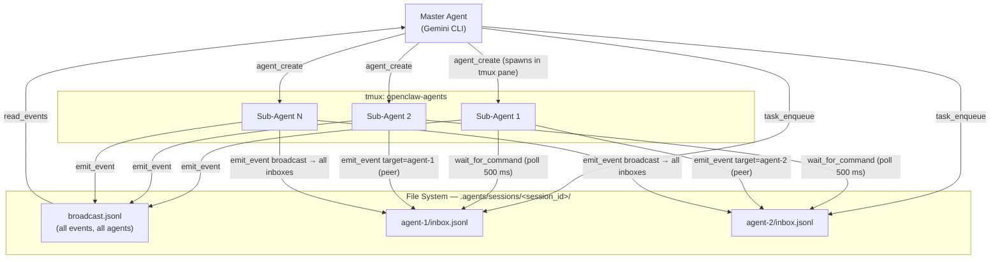

# Agent Orchestrator MCP Server

A **Model Context Protocol (MCP)** server that enables a master Gemini CLI agent to spawn, orchestrate, and manage multiple sub-agents within **tmux** sessions.

Designed for [OpenClaw](https://github.com/openclaw/openclaw) and Gemini CLI environments.

## Features

- **Tmux-based Isolation**: Each sub-agent runs in its own dedicated tmux pane.
- **Session Isolation**: Complete separation of workspaces and event logs per execution session.
- **Bi-directional Communication**: Master agent can send tasks; Sub-agents emit events (logs, results).
- **Auto-Inception**: Sub-agents are automatically prompted with their role and protocol upon startup.
- **Native Gemini CLI**: Sub-agents run actual `gemini` CLI instances with configurable models.

## Architecture

The diagram below shows how the master agent, sub-agents, and the file-based message bus interact.



**Communication patterns:**

- **Master → Agent**: `task_enqueue` appends a task to the target agent's `inbox.jsonl`. The agent picks it up on the next `wait_for_command` poll (every 500 ms, cursor-based so no message is lost).
- **Agent → Master**: `emit_event` appends to the agent's own `outbox.jsonl` and the session-wide `broadcast.jsonl`. The master reads `broadcast.jsonl` via `read_events`.
- **Agent → Agent (peer)**: `emit_event` with `target=<agent_id>` writes the event directly into the target agent's `inbox.jsonl`, where it is received as a command on the next poll.
- **Agent → All (broadcast)**: `emit_event` with no target fans the event out to every other agent's `inbox.jsonl` simultaneously.

## Prerequisites

Before running this server, ensure you have the following installed on your system:

- **[tmux](https://github.com/tmux/tmux/wiki)** (Required): This server relies heavily on `tmux` for process isolation and pane management.
- **Node.js** (v18+): Required to run the MCP server.
- **Gemini CLI** (Optional): If you plan to spawn standard Gemini agents, the `gemini` command should be in your PATH.

## Installation & Usage

### 1. Install as Gemini Extension

The easiest way to use this orchestrator is to install it directly to your Gemini CLI:

```bash
gemini extension install --auto-update https://github.com/kkweon/agent-orchestrator-mcp
```

### 2. Standalone Execution (via npx)

You can also run the MCP server directly using `npx`, which is useful for testing or manual configuration:

```bash
npx @kkweon/agent-orchestrator-mcp
```

### Configuration (gemini-extension.json)

If you need to configure it manually in your `gemini-extension.json`:

```json
{
  "mcpServers": {
    "orchestrator": {
      "command": "npx",
      "args": ["-y", "@kkweon/agent-orchestrator-mcp"]
    }
  }
}
```

## 🛠️ Tools Reference

### Orchestrator Tools (For Master Agent)

Use these tools to manage your workforce.

| Tool Name | Description | Parameters |
|-----------|-------------|------------|
| **`agent_create`** | Spawns a new sub-agent in a split tmux pane. It automatically injects the runner loop and inception prompt. | `name` (string): Human-readable name<br>`role` (string): Specific role (e.g., "coder", "reviewer")<br>`model` (string, optional): Specific Gemini model to use |
| **`agent_list`** | Lists all active agents in the current session. | *(None)* |
| **`task_enqueue`** | Sends a task payload to a specific agent's inbox. | `agent_id` (string): Target agent's UUID<br>`task` (object): Arbitrary JSON payload (instructions) |
| **`agent_delete`** | Terminates a sub-agent and kills its tmux pane. | `agent_id` (string): Target agent's UUID |

### Internal Protocol Tools (For Sub-Agents)

*These tools are used automatically by the sub-agents to communicate with the orchestrator. You rarely need to call them manually.*

- **`wait_for_command`**: Long-polling endpoint for sub-agents to fetch new tasks from their `inbox`.
- **`emit_event`**: Endpoint for sub-agents to report logs, progress, and results (`task_completed`) to the `outbox` and session broadcast.

## Development

```bash
# Install dependencies
npm install

# Build
npm run build

# Run tests
npm test
```

## License

MIT
