# Agent Orchestrator MCP Server

A **Model Context Protocol (MCP)** server that enables a master Gemini CLI agent to spawn, orchestrate, and manage multiple sub-agents within **tmux** sessions.

Designed for [OpenClaw](https://github.com/openclaw/openclaw) and Gemini CLI environments.

## Features

- **Tmux-based Isolation**: Each sub-agent runs in its own dedicated tmux pane.
- **Session Isolation**: Complete separation of workspaces and event logs per execution session.
- **Actor Model Communication**: Decentralized, asynchronous messaging using per-agent and master inboxes.
- **Auto-Inception**: Sub-agents are automatically prompted with their role and protocol upon startup.
- **Native Gemini CLI**: Sub-agents run actual `gemini` CLI instances with configurable models.

## Architecture

### Sessions

Each time a user runs `gemini`, a new **session** is created with a unique ID. Sessions are fully isolated — agents in Session A cannot see or send messages to agents in Session B. A user can run as many sessions as they like in parallel.


### Inside a Session

Within a session the master agent spawns sub-agents into tmux panes. All communication is routed through append-only JSONL mailbox files. Every component — the master, each sub-agent, and the MCP server itself — can read and write without holding any in-process state.

```mermaid
graph TD
    Master["Master Agent<br/>(Gemini CLI + MCP)"]

    subgraph Tmux["tmux session: openclaw-agents"]
        P1["Pane — Sub-Agent 1<br/>(Gemini CLI)"]
        P2["Pane — Sub-Agent 2<br/>(Gemini CLI)"]
        PN["Pane — Sub-Agent N<br/>(Gemini CLI)"]
    end

    subgraph FS[".agents/sessions/&lt;session_id&gt;/"]
        MI["master_inbox.jsonl<br/>(messages for Master)"]
        D1["agents/agent-1/<br/>inbox.jsonl"]
        D2["agents/agent-2/<br/>inbox.jsonl"]
        DN["agents/agent-N/<br/>inbox.jsonl"]
    end

    Master -->|"agent_create → spawns"| P1
    Master -->|"agent_create → spawns"| P2
    Master -->|"agent_create → spawns"| PN

    Master -->|"send_message"| D1
    Master -->|"send_message"| D2

    P1 <-->|"wait_for_command / send_message"| D1
    P2 <-->|"wait_for_command / send_message"| D2
    PN <-->|"wait_for_command / send_message"| DN

    D1 -->|"send_message(target=master)"| MI
    D2 -->|"send_message(target=master)"| MI
    DN -->|"send_message(target=master)"| MI

    MI -->|"read_inbox"| Master
```



### Communication Patterns

All communication is file-based and append-only. There are four routing modes, shown in order below.

```mermaid
sequenceDiagram
    participant Master
    participant MI as master_inbox.jsonl
    participant Inbox1 as agent-1/inbox.jsonl
    participant Agent1 as Sub-Agent 1
    participant Inbox2 as agent-2/inbox.jsonl
    participant Agent2 as Sub-Agent 2

    Note over Master,Agent2: 1 — Master sends a task to an agent
    Master->>Inbox1: send_message(payload, target="agent-1")
    Agent1->>Inbox1: wait_for_command (polls every 500 ms)
    Inbox1-->>Agent1: task + next_cursor

    Note over Master,Agent2: 2 — Agent reports result to master
    Agent1->>Agent1: execute task
    Agent1->>MI: send_message(result, target="master")
    MI-->>Master: read_inbox

    Note over Master,Agent2: 3 — Agent sends a targeted peer message
    Agent1->>Inbox2: send_message(data, target="agent-2")
    Agent2->>Inbox2: wait_for_command (polls)
    Inbox2-->>Agent2: event from Agent 1

    Note over Master,Agent2: 4 — Agent broadcasts to all peers
    Agent2->>Inbox1: send_message(data, target="all")
    Agent2->>MI: send_message(data, target="all")
    Inbox1-->>Agent1: broadcast event
```



## Prerequisites

Before running this server, ensure you have the following installed on your system:

- **[tmux](https://github.com/tmux/tmux/wiki)** (Required): This server relies heavily on `tmux` for process isolation and pane management.
- **Node.js** (v18+): Required to run the MCP server.
- **Gemini CLI** (Optional): If you plan to spawn standard Gemini agents, the `gemini` command should be in your PATH.

## Installation & Usage

### 1. Install as Gemini Extension

The easiest way to use this orchestrator is to install it directly to your Gemini CLI:

```bash
gemini extension install --auto-update https://github.com/kkweon/agent-orchestrator-mcp
```

### 2. Standalone Execution (via npx)

You can also run the MCP server directly using `npx`, which is useful for testing or manual configuration:

```bash
npx @kkweon/agent-orchestrator-mcp
```

### Configuration (gemini-extension.json)

If you need to configure it manually in your `gemini-extension.json`:

```json
{
  "mcpServers": {
    "orchestrator": {
      "command": "npx",
      "args": ["-y", "@kkweon/agent-orchestrator-mcp"]
    }
  }
}
```

## 🛠️ Tools Reference

### Orchestrator Tools (For Master Agent)

Use these tools to manage your workforce.

| Tool Name | Description | Parameters |
|-----------|-------------|------------|
| **`agent_create`** | Spawns a new sub-agent in a split tmux pane. It automatically injects the runner loop and inception prompt. | `name` (string): Human-readable name<br>`role` (string): Specific role (e.g., "coder", "reviewer")<br>`model` (string, optional): Specific Gemini model to use |
| **`agent_list`** | Lists all active agents in the current session. | *(None)* |
| **`send_message`** | Sends a message to one or more agents. Use target="all" to broadcast. | `agent_id` (string): Sender's agent ID (use 'master' if orchestrator is sending)<br>`message` (object): Arbitrary JSON payload<br>`target` (string/array): 'all', 'master', or agent UUID(s) |
| **`read_inbox`** | Non-blocking read of messages from an inbox. Use agent_id='master' for orchestrator. | `agent_id` (string): Target inbox ('master' or agent UUID)<br>`cursor` (number, optional): Line index to resume from |
| **`agent_delete`** | Terminates a sub-agent and kills its tmux pane. | `agent_id` (string): Target agent's UUID |

### Internal Protocol Tools (For Sub-Agents)

*These tools are used automatically by the sub-agents to communicate with the orchestrator. You rarely need to call them manually.*

- **`wait_for_command`**: Long-polling endpoint for sub-agents to fetch new tasks from their `inbox`.
- **`send_message`**: Endpoint for sub-agents to report logs, progress, and results (with `target="master"`) or communicate with peers.

## Development

```bash
# Install dependencies
npm install

# Build
npm run build

# Run tests
npm test
```

## License

MIT